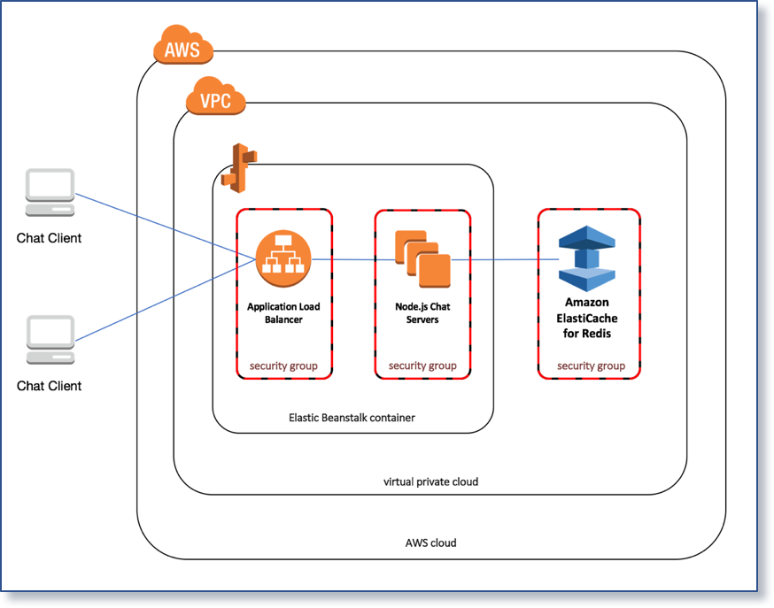

# elasticache-chatapp

Example architecture for building a web based chat application integrating Amazon ElastiCache for Redis.

The ElastiCache Chat Application (see diagram below) demonstrates how to build a web chat client using Vue.js and Socket.io on the frontend to communicate with a backend service using Node.js, Socket.io and Amazon ElastiCache for Redis for PubSub communication.

The included CloudFormation templates assumes the use of an AWS account with a default VPC enabled.

This repository contains sample code for the frontend web client as well as the backend service implementation.  The web client is built using Vue.js for DOM manipulation and Socket.io for websocket communication to the backend service.  The web client HTML, CSS and Javascript are delivered to a web browser using the S3 service static website hosting feature.

The backend service is implemented using Node.js and Socket.io, and hosted on EC2 instances managed by ElasticBeanstalk balanced by the Application Load Balancer, which supports websocket communication.  The Node.js service uses the ioredis.io library to communicate with an ElastiCache for Redis cluster, which supports communication between the service instances using builtin PubSub features to Redis.

## Deploying the example

The **Launch Stack** button below will launch the template in the us-east-1 region in your account:

## Testing the example

The application can be tested by performing the following steps:

1. Login to the **AWS Management Console**.  
2. In the upper right hand corner, choose the primary region (Virginia).  
3. From the **Services** menu in the top left, choose Amazon CloudFormation.  
4. Click **Stacks** from the menu on the left side.  
5. Click **chatapp** from the table of CloudFormation stacks.
6. Navigate to the **Outputs** section of the CloudFormation stack, expand the section, and locate the **ApplicationUrl** created by the template
7. Copy the URL to your clipboard
8. Open a web browser and paste the URL into the location

This browser window represents one participant in the chat room.  User registration and authentication are not part of the example, and participant usernames and avatars are generated at random each time the client is loaded or refreshed in the browser.  Once the client is loaded in the browser, you should see a chatroom like the screenshot below:

You can chat with other participants in the room by typing in the message box at the bottom of the screen and clicking the Send button.  Messages that you type will appear in your chatroom and the chatroom of the other participants.

To simulate multiple users, you can open additional browser windows to add new participants to the chatroom.  New participants are added to the list on the left.  When you close a browser window, the participants are removed from the list of the other chatrooms, but the message history is retained.

## Cleaning up the example resources

To remove all resources created by this example, delete the **AWS CloudFormation** stack in the us-east-1 region.
# appChatV1
